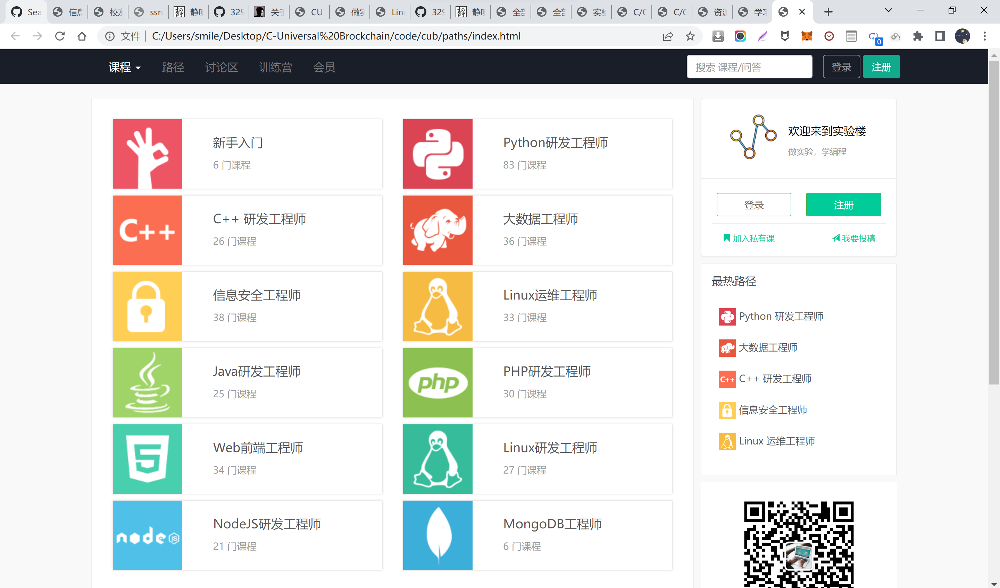
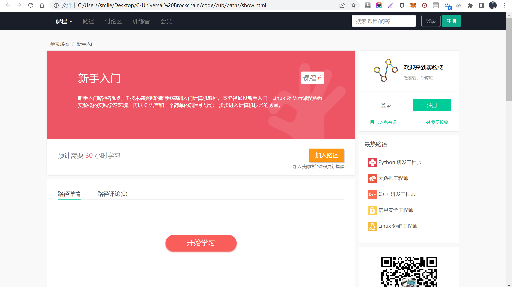

# paths

index




show




```
    vU_: C:\Users\smile\Desktop\C-Universal Brockchain\code\cub\paths
```


Mode                 LastWriteTime         Length Name                                                                 

----                 -------------         ------ ----

-a----         2022/4/24     13:44          36745 index.html                                                           

-a----          2022/6/6     18:53              0 readme.md                                                            

-a----         2022/4/23     17:35          36295 show.html                                                            


wS �|�~ �v�e�N9Y PATH Rh�

wS�^R�S:N DE95-1D97

C:.

�l	gP[�e�N9Y 


